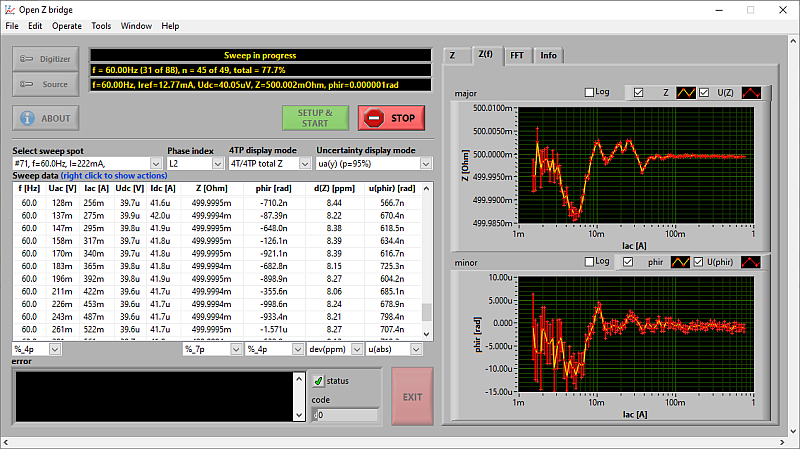

# Open Z bridge

`Open Z bridge` is simple extension for automatic measurement of low impedances and complex voltage ratio for [TWM tool](https://github.com/smaslan/TWM). It was developed in scope of [EMPIR](https://msu.euramet.org/calls.html) project [LiBforSecUse - Lithium Batteries for Second Life Applications](https://www.ptb.de/empir2018/libforsecuse/project/overview/) with intention to provide simple tool for calibration of low impedance standards using common instruments such as digitizing multimeters 3458A.
 
TWM tool itself was designed for digitizing voltage and current waveforms and calculating desired parameters from them. However, it was not designed to control signal source or performing automatic sequencing of measurements. This is performed via TWM Server API by this simple application. 

Features:
- Developed in LabVIEW 2020.
- Automatic measurement of frequency sweep, current sweep, DC bias current sweep or combined frequency/current sweep.
- Digitizing and signal processing via TWM tool using algorithms TWM-LowZ (low impedance )or TWM-InpZ (high impedance).
- Support of several signal sources (NI9260, Tektronix 3100, Agilent 33120A, Fluke 5000 series calibrators).
- Measurement of impedance or complex voltage ratio.
- Exporting simple reports to XLS file.
- Usable for measurement and direct generation of several correction file for TWM tool. 
- Full documentation and practice guide available.

## News
Important changes and news:
- 2018-11-11: First commit.
- 2022-01-13: First release.

## Download
Builds are available in git folder  [`/builds`](https://github.com/smaslan/open-z-bridge/blob/master/builds)

## License
The Open-Z-bridge is distributed under [MIT license](./LICENSE.txt). 

## External libraries
Open-Z-bridge depends on following external software:
1. [TWM tool](https://github.com/smaslan/TWM). Has to be installed externally.
1. [info-strings](https://github.com/KaeroDot/info-strings). Included in Open-Z-bridge.
1. [AX Excel](https://gitlab.com/smaslan/xls-template-and-stuff). Included in Open-Z-bridge.
1. [vilib](https://gitlab.com/cmi-6011/vilib). Included in Open-Z-bridge.

## Building

The `lvprog/Open Z bridge.lvproj` contains several build specifications:
- Open-Z-bridge-full
- Open-Z-bridge-visa

"Open-Z-bridge - full" builds for all implemented hardware (VISA driver and DAQmx driver). To run it, user has to install both NI libraries for NI-DAQ, VISA, and of course run time libraries for LabVIEW. Because many users use digitizers not requiring NI-DAQ, other builds are generated. Running VI `build/Build All Versions.vi` will offer automatic build of all builds versions and copies all versions of EXE files of the other builds to "Open-Z-bridge - full" folder for convenience. 